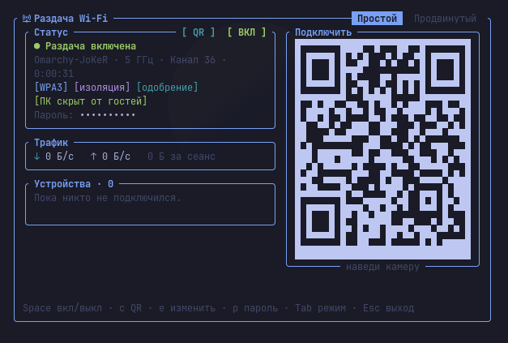
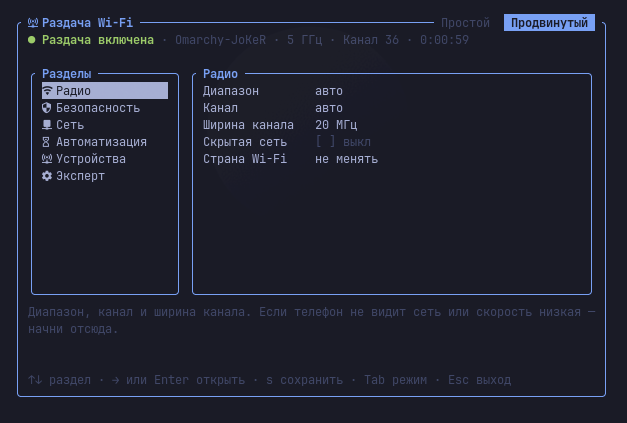
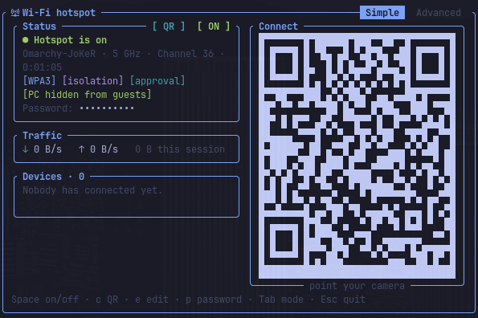
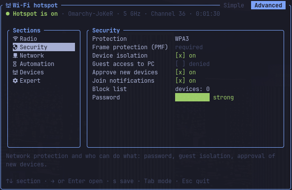

# omarchy-hotspot

**Русский** · [English](#english)

Раздача Wi-Fi с ПК для [Omarchy](https://omarchy.org): значок на панели и компактное окно в стиле
системных утилит Omarchy (Impala, bluetui).




## Возможности

- **Простой режим:** включить и выключить, QR-код для телефона, подключённые устройства и трафик.
- **Продвинутый режим:** имя сети, пароль, защита, диапазон и канал, DNS, одобрение новых устройств,
  чёрный список, авто-выключение, журнал и проверка системы.
- **Безопасность:** WPA3 (или совместимый режим WPA2/WPA3), гости не видят ПК и друг друга, новое устройство
  не получает интернет, пока ты его не одобришь. Пароль хранит NetworkManager, в логи и конфиг он не пишется.
- Значок на панели Omarchy, пункты в меню, уведомления, управление мышью. Языки: русский, украинский, английский.

## Требования

- Omarchy 4 (Arch Linux, Hyprland), NetworkManager.
- Wi-Fi-адаптер с режимом точки доступа (AP). Проверка после установки: `omarchy-hotspot doctor`.
- Интернет по кабелю или через второй адаптер: одна Wi-Fi-карта не может одновременно
  подключаться к сети и раздавать её.
- Пакеты (ставятся сами): `networkmanager`, `iw`, `dnsmasq`, `nftables`, `polkit`, `libnotify`, `jq`.
  Для сборки из исходников ещё `rust`. Если включён `ufw`, раздача добавляет в него свои правила и снимает их при выключении.

## Установка

### Вариант 1: пакет AUR (рекомендуется)

```bash
yay -S omarchy-hotspot
omarchy-hotspot-setup
```

- `yay -S omarchy-hotspot` собирает и ставит пакет: программу, помощника защиты, правило polkit и службы.
- `omarchy-hotspot-setup` добавляет значок на панель, пункты меню и правило окна — для твоего пользователя.
  Запускается без `sudo`. Обновления приходят вместе с пакетом.

### Вариант 2: из исходников

```bash
git clone https://github.com/JoK3Rbro1337/omarchy-hotspot.git
cd omarchy-hotspot
./install.sh
```

Установщик предлагает поставить недостающие пакеты, собирает программу в `~/.local/bin/omarchy-hotspot`,
ставит помощника защиты в `/usr/lib/omarchy-hotspot/`, правило polkit и службу уборки. Каждую команду с `sudo`
он сначала показывает и спрашивает разрешение. Обновить: `git pull` и снова `./install.sh`.

Оба варианта сразу вместе не ставь: у них одни и те же системные файлы. Чтобы перейти с исходников на пакет,
сначала выполни `./uninstall.sh`.

### Что меняется в твоих настройках

Перед правкой установщик показывает список файлов и спрашивает «Изменить эти файлы?». Если ответить «нет»,
программа всё равно работает — окно открывается командой `omarchy-hotspot`.

| Файл | Что добавляется |
|------|-----------------|
| `~/.config/hypr/hyprland.lua` | правило плавающего окна |
| `~/.config/omarchy/extensions/omarchy-menu.jsonc` | пункты «Hotspot» и «Hotspot On/Off» в меню Setup → Network |
| `~/.config/omarchy/plugins/io.github.jok3rbro1337.omarchy-hotspot/` и `~/.config/omarchy/shell.json` | значок на панели |

Вставки стоят между маркерами `omarchy-hotspot begin` / `end`, перед правкой делается копия `<файл>.bak-<дата>`.
Повторный запуск ничего не дублирует.

### Только значок через каталог плагинов

`omarchy plugin add https://github.com/JoK3Rbro1337/omarchy-hotspot` ставит **только значок** на панель.
Сама программа ставится отдельно — вариантом 1 или 2 выше. Без неё значок остаётся серым и на клики не отвечает.

## Как пользоваться

- **Значок на панели:** клик — окно, правый клик — включить или выключить, средний клик — обновить состояние.
- **Меню Omarchy:** Setup → Network → Hotspot.
- **Окно** появляется в правом верхнем углу под панелью, как панели сети и Bluetooth. Клавиши подсказаны внизу.
  Мышь тоже работает: клик по `[ ВКЛ / ВЫКЛ ]`, по вкладкам, разделу, параметру или устройству; колесо листает списки.
  QR-код для телефона — клавиша `c` или кнопка `[ QR ]`, повторное нажатие прячет. Окно закрывается по `Esc`
  или клику мимо него (отключается в настройках). Выделить текст — **Shift + перетаскивание**.
- **Терминал:**

| Команда | Что делает |
|---------|------------|
| `omarchy-hotspot` | открыть окно в этом терминале |
| `omarchy-hotspot open` | открыть окно Omarchy (как значок на панели) |
| `omarchy-hotspot on` / `off` / `toggle` | включить / выключить / переключить |
| `omarchy-hotspot status` | состояние (`--json` — для скриптов) |
| `omarchy-hotspot password`, `qr` | пароль и QR-код |
| `omarchy-hotspot devices` | подключённые устройства |
| `omarchy-hotspot doctor` | проверить, готова ли система |
| `omarchy-hotspot reset` | выключить и удалить всё, что создала раздача |

**Язык** берётся из системного (`$LANG`). Чтобы задать свой, добавь первой строкой в
`~/.config/omarchy-hotspot/config.toml` строку `language = "en"` (`ru`, `uk`, `en`). Разово — флаг
`omarchy-hotspot --lang en`.

## Горячая клавиша

Открой файл своих привязок клавиш:

```bash
nvim ~/.config/hypr/bindings.lua
```

Добавь в конец строки:

```lua
o.bind("SUPER + ALT + H", "Hotspot", "omarchy-hotspot open")
o.bind("SUPER + SHIFT + ALT + H", "Hotspot On/Off", "omarchy-hotspot toggle")
```

Первая строка открывает окно, вторая включает или выключает раздачу без окна. Сохрани файл —
Hyprland подхватит изменения сам (если нет, выполни `hyprctl reload`). Эти сочетания в Omarchy свободны;
занятые сочетания показывает `SUPER + K`.

## Удаление

**Пакет AUR:**

```bash
omarchy-hotspot-remove
sudo pacman -Rns omarchy-hotspot
```

- `omarchy-hotspot-remove` выключает раздачу, удаляет её профиль сети с паролем и настройки,
  убирает значок, пункты меню и правило окна.
- `sudo pacman -Rns omarchy-hotspot` удаляет сам пакет: программу, помощника, правило polkit и службы.
  Перед удалением пакет сам выключает раздачу, удаляет её профиль сети и снимает правила брандмауэра.

**Из исходников:**

```bash
./uninstall.sh
```

Убирает всё то же самое и системные файлы (спросит разрешение на `sudo`).

В обоих случаях копии изменённых конфигов остаются рядом с ними (`*.bak-<дата>`).
Если значок ставился через `omarchy plugin add`, его тоже убирают эти команды.

## Безопасность

- Единственная часть с правами root — помощник `/usr/lib/omarchy-hotspot/omarchy-hotspot-helper`.
  Он выполняет только короткий заранее заданный список действий (правила брандмауэра раздачи, файл DNS,
  блокировка и отключение устройства, код страны для Wi-Fi, чтение списка выданных гостям адресов)
  и проверяет каждый аргумент. Программа вызывает его через `pkexec`.
- Правило polkit разрешает это без пароля любой программе твоего пользователя, если ты вошёл в систему
  за этим компьютером (активный локальный сеанс), — в том числе фоновой службе раздачи. Прямым входам
  по SSH и неактивным сеансам — отказ. Поэтому помощник умеет только перечисленное выше и ничего больше.
- Служба `omarchy-hotspot-cleanup` при загрузке убирает правила брандмауэра, если раздача не выключилась штатно.
- Подробно: [`docs/SECURITY.md`](docs/SECURITY.md) (модель угроз, помощник, брандмауэр, polkit),
  [`docs/DECISIONS.md`](docs/DECISIONS.md) (архитектура), [`docs/UI.md`](docs/UI.md) (интерфейс).

## Лицензия

[MIT](LICENSE).

---

## English

Wi-Fi hotspot for [Omarchy](https://omarchy.org): a bar icon and a compact window in the style of
Omarchy's system tools (Impala, bluetui).




### Features

- **Simple mode:** on/off, QR code for phones, connected devices and traffic.
- **Advanced mode:** network name, password, security, band and channel, DNS, approval of new devices,
  block list, idle auto-off, log and system check.
- **Security:** WPA3 (or WPA2/WPA3 transition mode), guests cannot reach the PC or each other, a new device
  gets no internet until you approve it. The password is stored by NetworkManager and never written to logs or the config.
- Omarchy bar icon, menu entries, notifications, mouse support. Languages: Russian, Ukrainian, English.

### Requirements

- Omarchy 4 (Arch Linux, Hyprland), NetworkManager.
- A Wi-Fi adapter that supports AP mode. Check after installing: `omarchy-hotspot doctor`.
- Internet over Ethernet or a second adapter: one Wi-Fi card cannot be a client and an access point at once.
- Packages (installed automatically): `networkmanager`, `iw`, `dnsmasq`, `nftables`, `polkit`, `libnotify`, `jq`;
  `rust` to build from source. If `ufw` is enabled, the hotspot adds its own rules and removes them when turned off.

### Install

**Option 1: AUR package (recommended)**

```bash
yay -S omarchy-hotspot
omarchy-hotspot-setup
```

The package installs the app, the security helper, the polkit policy and services. `omarchy-hotspot-setup`
(run without `sudo`) adds the bar icon, menu entries and the window rule for your user.

**Option 2: from source**

```bash
git clone https://github.com/JoK3Rbro1337/omarchy-hotspot.git
cd omarchy-hotspot
./install.sh
```

The installer offers to install missing packages, builds the app into `~/.local/bin/omarchy-hotspot`,
and installs the helper into `/usr/lib/omarchy-hotspot/`, the polkit policy and a boot-time cleanup service.
Every `sudo` command is shown and confirmed first. To update: `git pull` and run `./install.sh` again.

Do not install both at once: they share system files. To switch from source to the package, run `./uninstall.sh` first.

**What changes in your config.** Before editing, the installer lists the files and asks for consent. If you say no,
the app still works — open the window with `omarchy-hotspot`.

| File | What is added |
|------|---------------|
| `~/.config/hypr/hyprland.lua` | floating window rule |
| `~/.config/omarchy/extensions/omarchy-menu.jsonc` | “Hotspot” and “Hotspot On/Off” in Setup → Network |
| `~/.config/omarchy/plugins/io.github.jok3rbro1337.omarchy-hotspot/` and `~/.config/omarchy/shell.json` | bar icon |

Insertions are wrapped in `omarchy-hotspot begin` / `end` markers, each edited file gets a `<file>.bak-<date>` copy,
and re-running never duplicates anything.

**Icon only, from the plugin catalog.** `omarchy plugin add https://github.com/JoK3Rbro1337/omarchy-hotspot`
installs **only the bar icon**. Install the app itself with option 1 or 2; without it the icon stays grey and does nothing.

### Usage

- **Bar icon:** click opens the window, right click toggles the hotspot, middle click refreshes.
- **Omarchy menu:** Setup → Network → Hotspot.
- **Window:** opens in the top-right corner under the bar, like the network and Bluetooth panels. Keys are listed
  at the bottom; the mouse works too. Show the QR code with `c` or the `[ QR ]` button. The window closes with `Esc`
  or when you click outside it (can be turned off in settings). Select text with **Shift + drag**.
- **Terminal:** `omarchy-hotspot` (window), `open`, `on` / `off` / `toggle`, `status [--json]`, `password`, `qr`,
  `devices`, `doctor`, `reset`. Run `omarchy-hotspot --help` for everything.

**Language** follows `$LANG`. To pin it, add `language = "en"` (`ru`, `uk`, `en`) as the first line of
`~/.config/omarchy-hotspot/config.toml`, or pass `--lang en` once.

### Keyboard shortcut

Add these lines to `~/.config/hypr/bindings.lua`:

```lua
o.bind("SUPER + ALT + H", "Hotspot", "omarchy-hotspot open")
o.bind("SUPER + SHIFT + ALT + H", "Hotspot On/Off", "omarchy-hotspot toggle")
```

The first opens the window, the second toggles the hotspot. Hyprland reloads the file on save
(otherwise run `hyprctl reload`). Both combinations are free in a stock Omarchy; `SUPER + K` lists the taken ones.

### Uninstall

**AUR package:**

```bash
omarchy-hotspot-remove
sudo pacman -Rns omarchy-hotspot
```

`omarchy-hotspot-remove` turns the hotspot off, deletes its network profile (with the password) and settings,
and removes the bar icon, menu entries and the window rule. `pacman -Rns` removes the package; before that it
turns the hotspot off, deletes its network profile and clears its firewall rules.

**From source:**

```bash
./uninstall.sh
```

Removes the same things plus the system files (asks before using `sudo`). Backups of edited configs are kept (`*.bak-<date>`).

### Security

- The only part running as root is the helper `/usr/lib/omarchy-hotspot/omarchy-hotspot-helper`. It accepts
  a short fixed list of actions (hotspot firewall rules, DNS file, blocking and disconnecting a device, Wi-Fi country code,
  reading the list of addresses given to guests) and validates every argument.
  The app calls it through `pkexec`.
- The polkit policy allows this without a password for any program of your user while you are logged in at the computer
  (active local session), including the hotspot background service. Direct SSH logins and inactive sessions are denied.
  That is why the helper can do only the actions listed above.
- The `omarchy-hotspot-cleanup` service removes firewall rules at boot if the hotspot was not turned off cleanly.
- Details: [`docs/SECURITY.md`](docs/SECURITY.md), [`docs/DECISIONS.md`](docs/DECISIONS.md), [`docs/UI.md`](docs/UI.md)
  (these documents are in Russian).

### License

[MIT](LICENSE).
